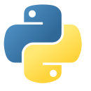
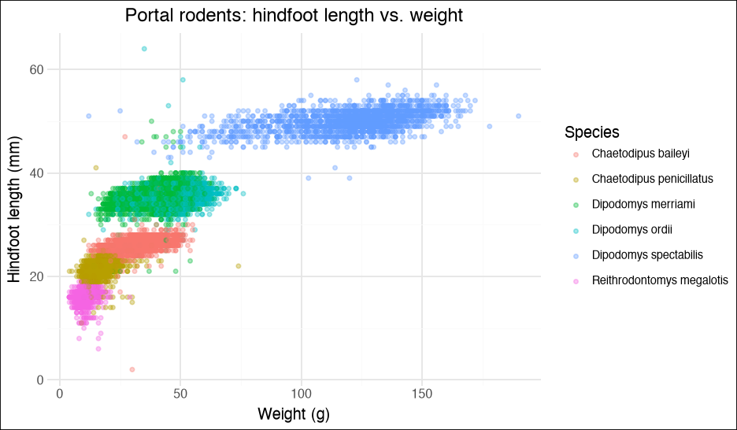
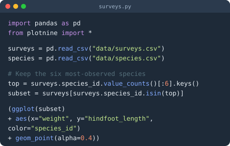
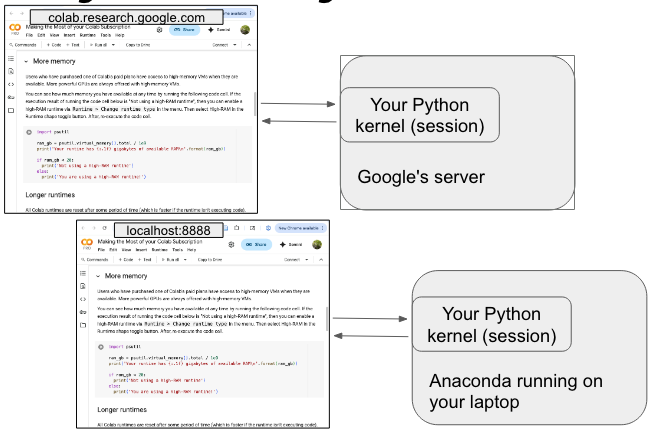
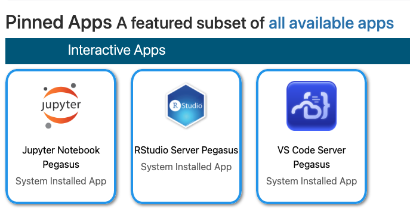

## {.custom-title background-color="#306998"}

::: {.ct-title}
{.ct-pylogo} Python in Half a Day
:::

::: {.ct-subtitle}
An introductory, hands-on Python workshop
:::

::: {.ct-author}
Dan Kerchner · George Washington University Libraries & Academic Innovation · Fall 2026
:::

::: {.ct-images}
{.ct-card width="470"} {.ct-card width="430"}
:::

## FAQs {background-color="#306998" .divider}

::: {.incremental}
- **Will you sign my form for Professional Enhancement Hours?** — Yes, email me: _kerchner@gwu.edu_
- **Can I get a copy of the notebooks?** — [github.com/kerchner/half-day-python](https://github.com/kerchner/half-day-python) — in the "notebooks" folder
- **Will this workshop be recorded?** — No, so hang on for the ride!
:::

## Upcoming Python Workshops (Fall 2026) 🗓️ {background-color="#306998" .divider .smaller}

**Python camp** is a mini-course that will earn you a certificate of completion.

**Dates:**

- Thursday, Nov. 19 | 1-5pm
- Friday, Nov. 20 | 1-5pm
- Monday, Nov. 23 | 1-5pm
- Tuesday, Nov. 24 | 1-5pm
plus ~ 1-2 hours per day of self-guided homework.

Apply by **September 21** using the application form link at [gwu-libraries.github.io/python-camp](https://gwu-libraries.github.io/python-camp/)

<hr>

📅 Find all GW Libraries workshops and events at
_[library.gwu.edu/events](https://library.gwu.edu/events)_

## Workshop Goals

- Get comfortable **reading and writing basic Python code**
- Learn the core **building blocks**: variables, lists, dictionaries, loops, functions
- Know **where to get help** when you're on your own

## Why Learn Python When AI Can Write Code? {.smaller}

::: {.incremental}
- **You can't check what you can't read** — AI code is often *almost* right: an off-by-one index, a silently dropped `NaN`, a wrong merge. Only someone who reads code catches that.
- **You knowing the concepts makes AI better** — "group by species, then take the mean weight" gets you a far better answer than a vague request.
- **Editing beats re-prompting** — tweaking a line or a plot by hand is faster/cheaper than another round with the chatbot.
- **AI is a great tutor for those who engage** — it can explain, unblock, and accelerate you, but only if you understand what it's showing you.
- **YOU still own the analysis** — **your** name is on the paper or report; "the AI wrote it" is not a methods section; you are responsible for any issues.
:::

::: {.tip-box}
🤖 Think of AI as a fast, confident, *occasionally wrong* assistant. It writes the code — **you** are still the analyst. Use AI to *improve your coding skills*!
:::

## Learning Objectives {.smaller}

By the end of this workshop, you will be able to:

::: {.incremental}
1. Write and run Python code in a **notebook** (Google Colab / Jupyter)
1. Create and use **variables** and understand basic **types** (`int`, `float`, `str`, `bool`)
1. Store collections of data in **lists**, **tuples**, **sets**, and **dictionaries**
1. Repeat work with **`for`** and **`while`** loops; make decisions with **`if` / `elif` / `else`**
1. Write your own **functions** with `def`
1. **Import libraries** and get **help**
1. Get unstuck: Look for help to overcome obstacles
:::

## What is Python? {.smaller}

- A **free, open-source**, general-purpose programming language
- Created by Guido van Rossum in 1991 — named after *Monty Python*, not the snake 🐍
- Maintained by the **Python Software Foundation**, with 500,000+ community packages on [PyPI](https://pypi.org)
- Runs on Windows, macOS, and Linux — and in your browser via Google Colab
- Designed to be **readable**: code that looks almost like English
- A complete toolkit: **data analysis, statistics, visualization, machine learning, automation, web apps** — one language for all of it

::: {.tip-box}
💡 Python is both a *language* you write and an *ecosystem* of libraries (`pandas`, `numpy`, `matplotlib`, `scikit-learn`, …) and a famously welcoming community.
:::

## Why Do Researchers Use Python? {.smaller}

::: {.incremental}
- **It's free** — no license fees, ever, on any machine
- **Reproducibility** — your analysis is a script or notebook you can rerun, share, and cite
- **One language, many jobs** — clean data, run statistics, train ML models, scrape the web, automate files, build apps
- **Machine learning & AI** — PyTorch, TensorFlow, scikit-learn, Hugging Face: new methods land in Python first
- **Data wrangling** — `pandas` makes cleaning, reshaping, and transforming messy data intuitive
- **Any data source** — CSV, Excel, SPSS, Stata, SAS, JSON, databases, web APIs
- **Community** — vibrant support: Stack Overflow, PyLadies, local user groups, endless free tutorials
- **Jobs** — consistently one of the most in-demand languages in industry *and* academia
:::

## Python or R? {.smaller}

Both are free, open-source, and excellent for data work — they just have different centers of gravity:

| | Reach for **Python** when… | Reach for **R** when… |
|-|-----------------------------|-----------------------|
| **The task** | Machine learning / AI, automation, web apps, working with text or files at scale | Statistical analysis, exploring & visualizing data, writing up results |
| **Strengths** | General-purpose language; deep learning (PyTorch, TensorFlow); huge ecosystem beyond data | Built *for* statistics; `ggplot2` graphics; tidyverse; R Markdown/Quarto reports |
| **Your field** | Common in computer science, engineering, physics, industry data science | Common in statistics, biostatistics, epidemiology, ecology, social sciences |
| **New methods** | Cutting-edge *ML/AI* methods often land in Python first | Cutting-edge *statistical* methods often land in R first |
: {tbl-colwidths="[14,43,43]"}

::: {.tip-box}
🤝 It's not a rivalry — many researchers use **both**, and tools like **Quarto** and **Positron** support the two side by side. The best first language is the one *your field and collaborators* use.
:::

## Where You Write Python {.smaller}

| Tool | Type | What it is |
|----|----| -----------------------|
| **Google Colab** | In browser | Jupyter notebooks hosted by Google — nothing to install; free tier (GW folks can get Colab Pro) |
| **Jupyter Notebook / JupyterLab** | In browser, runs locally | The classic notebook interface: text + code + output in one document |
| **VS Code** | Desktop app | Popular, free general-purpose editor — excellent Python & notebook support via extensions |
| **Positron** | Desktop app | Posit's free **next-generation** data-science IDE for Python *and* R, built on VS Code |
| **Spyder** | Desktop app | Free, scientific IDE that feels like RStudio / MATLAB; ships with Anaconda |
| **PyCharm** | Desktop app | Full-featured professional Python IDE (free Community edition, but get the educational license for PyCharm Professional) |

::: {.tip-box}
🖥️ Today we'll use **Google Colab** — open the notebook link, sign in, and you're coding.
:::

## Choosing a Tool: Pros and Cons {.smaller}

| Tool | 👍 Pros | 👎 Cons |
|--------|----------|---------|
| **Google Colab** | No install; free GPUs; easy to share like a Google Doc | Needs a Google account & Internet; sessions time out; your files live in Google Drive |
| **Jupyter / JupyterLab** | Same notebook format, on your own machine; your data stays local | You install and manage Python + packages yourself |
| **VS Code** | One editor for many languages; notebooks *and* scripts; huge extension ecosystem | More setup; general-purpose, so less tailored for data work |
| **Positron** | Built on VS Code but tailored for data work with Python *and* R; great Data Explorer | Newer, so still maturing |
| **Spyder / PyCharm** | Full-featured desktop IDEs | Heavier; less notebook-centric |
: {tbl-colwidths="[17,46,37]"}

::: {.tip-box}
🎯 We're using **Google Colab** today, but you may want to try **Positron** or **VS Code** later.
:::

## Where Python runs when you use a Python notebook

{fig-align="center" fig-alt="Two diagrams comparing where Python runs: a notebook at colab.research.google.com connected to a Python kernel on Google's server, and a notebook at localhost:8888 connected to a Python kernel from Anaconda running on your laptop"}

## Working in a Notebook {.smaller}

A notebook is a sequence of **cells**: some hold *text* (Markdown), some hold *code*.

| Action | How |
|--------|-----|
| Run the current cell | `Shift` + `Enter` (or the ▶ Play button) |
| Run the cell and insert a new one below | `Alt` + `Enter` |
| Add a code cell | **+ Code** button (Colab) / `B` in command mode (Jupyter) |
| See more shortcuts | **Tools → Keyboard shortcuts** (Colab) |

- The **last expression** in a cell is displayed automatically — no `print()` needed
- Cells share memory: a variable defined in one cell is available in all the others
- **Order matters**: cells run in the order *you* run them, not the order they appear
- You *will* get errors. That's fine — fix the cell and run it again

::: {.tip-box}
🔁 Need a fresh start? **Runtime → Restart** and run the cells top-to-bottom.
:::

## The Python Language {background-color="#306998" .divider}

## The notebook for today

* Go to https://github.com/kerchner/half-day-python
* 


## Variables and Types

Assign values with `=`:

```python
name    = "Lou"       # str   (text, in single or double quotes)
year    = 1972        # int   (whole number)
gdp     = 22.38       # float (decimal number)
casual  = True        # bool  (True / False -- capitalized!)

year + 10             # use a variable by name
#> 1982
type(gdp)             # ask Python what type something is
#> <class 'float'>
```

- Variable names: letters, numbers, and `_`. Can't start with a number; no spaces.
- Python is _case-sensitive_: `Year` and `year` are different!
- Types matter: `name * 4` repeats the text; `name + 2` is an **error**

## Comparison Operators

Expressions that evaluate to `True` or `False`:

```python
year = 1972

year == 1972      # equal to           -> True
year != 2020      # not equal to       -> True
year >  1980      # greater than       -> False
year <= 1975      # less than or equal -> True
1970 < year < 1980   # chained comparison -> True

# Combine with and, or, not
year > 1970 and year < 1980    # -> True
not (year == 1972)             # -> False
```

::: {.tip-box}
⚠️ `==` compares; `=` assigns. Mixing them up is everyone's first bug.
:::

## Lists

An **ordered** sequence of values, in square brackets:

```python
countries = ['Canada', 'Mexico', 'Italy', 'Cameroon', 'Jamaica']

countries[0]        # 'Canada'   -- the FIRST item is index 0!
countries[-1]       # 'Jamaica'  -- negative counts from the end
countries[1:3]      # ['Mexico', 'Italy']  -- slice: start up to (not including) stop
countries[:2]       # first two;  countries[3:] -> from index 3 to the end
len(countries)                  # 5
countries.append('Nepal')       # add to the end (changes the list)
countries + ['Egypt', 'Peru']   # combine lists (makes a new list)
'Italy' in countries            # True
```

- Lists can mix types: `[3, True, 'xyz', [1, 2]]` · Strings are list-like too: `name[0]`

::: {.tip-box}
🔢 Python counts from **0** — R counts from 1. Watch out if you switch!
:::

## Tuples and Sets {.smaller}

:::: {.columns}

::: {.column width="50%"}
**Tuple** — like a list, but **can't be changed**

```python
colors = ('blue', 'green', 'red')

colors[0]               # 'blue'
colors.append('pink')   # ERROR!
```

Use for things that shouldn't change — coordinates, an (x, y) pair, a fixed set of options.
:::

::: {.column width="50%"}
**Set** — **unique** values, no order

```python
a = set(['MD', 'FL', 'DE', 'DE'])   # {'MD', 'FL', 'DE'}
b = set(['VA', 'CA', 'FL'])

a - b     # difference:  in a, not b
a & b     # intersection: in both
a | b     # union:        in either
a ^ b     # in one but NOT both
```

Great for de-duplicating and comparing groups.
:::

::::

| | `[ ]` list | `( )` tuple | `{ }` set |
|---|---|---|---|
| Ordered? | ✅ | ✅ | ❌ |
| Changeable? | ✅ | ❌ | ✅ |
| Duplicates? | ✅ | ✅ | ❌ |

## Dictionaries

Pairs of **keys** and **values**, in curly braces:

```python
workshop = {'name': 'Python in Half a Day',
            'duration': 4,
            'instructors': ['Dan', 'Laura'],
            'awesome': True}

workshop['instructors']              # look up by key -> ['Dan', 'Laura']
workshop['location'] = 'Gelman'      # add a new key
workshop['duration'] = 3.5           # replace a value
'location' in workshop               # True  (checks the KEYS)
workshop.keys();  workshop.values();  workshop.items()
```

- Values can be anything — numbers, text, lists, even other dictionaries
- This is exactly the shape of **JSON** data from web APIs

## Values, Lists, and DataFrames

```python
year   = 1959                                               # a single value
songs  = ["So What", "Blue in Green", "All Blues"]          # a list: many values
tracks = [1, 3, 4]
album  = pandas.DataFrame({"song": songs, "track": tracks}) # a table
```

:::: {.columns .evolution}

::: {.column width="18%"}
**Value** · 1 × 1

| year |
|-----|
| 1959  |

*a single value*
:::

::: {.column width="7%" .evo-arrow}
→
:::

::: {.column width="22%"}
**List** · 1 × n

| tracks |
|--------|
| 1 |
| 3 |
| 4 |

*many values, in order*
:::

::: {.column width="7%" .evo-arrow}
→
:::

::: {.column width="46%"}
**DataFrame** · m × n

| song | track |
|------|-------|
| So What | 1 |
| Blue in Green | 3 |
| All Blues | 4 |

*columns are equal-length Series* 
:::

\* `DataFrame` is a `pandas`/`polars` class, so you need to import `pandas` or `polars`

::::

## Comments and Indentation

```python
# A comment starts with # -- Python ignores it; it's for the reader
scores = [70, 90, 81, 93]     # comments can follow code, too

for s in scores:
    print(s)                  # indented: INSIDE the loop
    print("still inside")
print("done")                 # not indented: OUTSIDE the loop
```

- **Indentation is not optional** in Python — it's how Python knows which lines belong to a loop, an `if`, or a function
- Use **4 spaces** per level (notebooks/editors do this for you after `:`)
- Every `for`, `while`, `if`, `else`, and `def` line ends with a **`:`**

::: {.tip-box}
💬 Comment the *why*, not the *what*, for your future self or other collaborators.
:::

## Iteration: `for` Loops

Repeat a block of code once for each item in a list (or any "iterable"):

```python
scores = [70, 90, 81, 93, 77]
top = max(scores)

for s in scores:
    curved = round(100 * s / top, ndigits=1)
    print("Score:", s, "-> curved:", curved)

# Loop over a dictionary's key/value pairs
for key, value in workshop.items():
    print(key, "=", value)

# Loop over a range of numbers: 0, 1, 2, 3, 4
for i in range(5):  # range(2, 5) would yield 2, 3, 4
    print(i)
```

## Iteration: `while` Loops

Repeat **while** a condition is True:

```python
import random

total = 0
while total < 50:
    total = total + random.randint(1, 10)
    print("Total so far:", total)

# `while True` runs forever... until `break`
while True:
    n = random.randint(1, 10)
    if n == 7:
        print("Lucky 7!")
        break
```

::: {.tip-box}
🎲 Random numbers differ every run. For a *repeatable* sequence, call `random.seed(42)` first (choose any number you like).
:::

## Conditionals: `if` / `elif` / `else`

Run a block of code only when a condition is `True`:

```python
scores = [61, 95, 70, 80, 85, 99]

for s in scores:
    if s >= 90:
        print(s, "is an A")
    elif s >= 70:
        print(s, "is a Pass")
    else:
        print(s, "is a Fail")
```

- `elif` = "else if" — check as many conditions as you like, in order
- Only the **first** matching block runs; `else` catches everything left over

## Functions

Package up code you want to reuse, with `def`:

```python
def fahrenheit_to_celsius(temp_f):
    """Convert a temperature from °F to °C."""
    temp_c = (temp_f - 32) * 5 / 9
    return temp_c

fahrenheit_to_celsius(100)          # 37.777...

def curve(score, top_score):
    return 100 * score / top_score

curve(89, 96)                       # arguments matched by position
curve(top_score=96, score=89)       # ...or by name, in any order
```

- `def` name, **parameters** in parentheses, `:`, indented body
- **`return`** sends a value back to whoever called the function
- Variables created *inside* a function only exist inside it (**scope**)

## Importing Libraries

Python's built-in functions (`print`, `len`, `max`, `type`, …) are just the start:

```python
sqrt(25)                  # NameError -- Python doesn't know sqrt() yet!

import math               # load the built-in math library...
math.sqrt(25)             # ...then call it as library.function

from math import sqrt     # or import just one function
sqrt(25)                  # now no prefix is needed

import pandas as pd       # import with a short nickname (convention!)
pd.read_csv("data.csv")
```

- The **standard library** (`math`, `random`, `datetime`, `os`, …) ships with Python
- Third-party libraries (`pandas`, `numpy`, `matplotlib`, …) are installed separately — Colab has the popular ones pre-installed

## Installing Packages

```bash
# In a terminal (or a notebook cell prefixed with !)
pip install pandas plotnine

# Or, with Anaconda / Miniconda / Miniforge:
conda install pandas plotnine
```

```python
# Then, in EVERY script or notebook that uses it:
import pandas as pd
```

- **Install once** per computer (or per environment); **import every session**
- Over 500K packages on **PyPI** ([pypi.org](https://pypi.org)), the Python Package Index
- Colab: most data-science packages are already installed. Missing one? `!pip install name` in a cell

## Getting Help

```python
help(round)                 # built-in function
help(random.randint)        # a function from a library
help(pd.DataFrame.merge)    # a method from pandas

round?                      # notebook shortcut: same thing, in a pop-up
surveys_df.<TAB>            # Tab-completion lists what's available
```

- **Read the error message** — the *last line* usually says exactly what went wrong
- Official docs: [docs.python.org](https://docs.python.org/3/)
- Search the error text, Stack Overflow has almost certainly seen it before
- Ask an AI assistant to *explain* the error, then verify the fix yourself

## Notebook or Script? {.smaller}

Two ways to write your analysis — both are real, reproducible code:

| | 👍 Pros | 👎 Cons |
|---|---------|---------|
| **Notebook** (`.ipynb`) | Narrative + code + results in one shareable document; great for exploring, teaching, and reports; renders on GitHub | Easy to run cells out of order and end up with hidden state; awkward for version control (`git`); not ideal for automation |
| **Script** (`.py`) | Simple — just code; runs top-to-bottom with `python analysis.py`; easy to reuse (`import`), automate, and run unattended on an **HPC cluster** | Explaining *why* is limited to `#` comments; results go to **files** (CSV, PNG, …) rather than appearing inline |

As a project grows, its code moves into scripts: **serious software** — larger programs, packages, web apps — is built as **multiple `.py` files** that `import` from one another. Every Python library you'll ever `import` is written this way.

::: {.tip-box}
🎯 Rule of thumb: **notebooks** to explore and to tell the *story*; **scripts** for reusable building blocks, automation, and multi-file software. Many projects use both — and **Quarto** lets a notebook become a polished report.
:::

## Recommended Best Practices {.smaller}

- **One folder per project** — keep data, notebooks, and outputs together; use *relative* paths (`data/surveys.csv`)
- **Restart and run all** before you share a notebook — proves it's reproducible top-to-bottom
- **Comment your code** (`#`) and use Markdown cells to explain your thinking
- **Never edit raw data by hand** — read it in, transform with code, write results to a *new* file
- Use **descriptive names**: `surveys_2024`, not `df2`
- **One environment per project** (`venv`, `conda`) — so package versions don't collide
- **Learn `git` early**, even just to keep a history of your own work, but also to collaborate

## Keep Learning: A More Complete Python Setup {.smaller}

These should be on your to-do list:

1. **Install Python on your own machine** — [Miniforge](https://conda-forge.org/download/) or [Anaconda](https://www.anaconda.com/download) (Python + package manager + Jupyter) or [python.org](https://www.python.org/downloads/)
2. **Pick an editor** — try [Positron](https://positron.posit.co/) (data-science IDE for Python & R) or [VS Code](https://code.visualstudio.com/) with the Python + Jupyter extensions
3. **Learn environments** — one `conda env` or `venv` per project keeps package versions from colliding
4. **Learn `git` / GitHub** and start using it with your Python projects
5. **Learn the `bash` "shell"** and use it in the Terminal
6. Keep going: the [official tutorial](https://docs.python.org/3/tutorial/), [pandas getting-started guide](https://pandas.pydata.org/docs/getting_started/), and *Python for Data Analysis* (free online: [wesmckinney.com/book](https://wesmckinney.com/book/))

## If You Need to Run Python on HPC*

GW HPC "Open On Demand" [ood.arc.gwu.edu](http://ood.arc.gwu.edu/) — includes **JupyterLab**
   
Start at [it.gwu.edu/hpc](https://it.gwu.edu/hpc) and submit an access request

*HPC = High Performance Computing

## Quarto: Notebooks Grow Up {.smaller}

- **Quarto** ([quarto.org](https://quarto.org/)) is a free, open-source publishing tool: you write ordinary text with code chunks mixed in, and it produces a finished, polished "document" — which can be a **web page, PDF, Word file, slide deck, website, book, or dashboard**
- The workflow: write a plain-text `.qmd` file (or use your existing `.ipynb`!) → **Render** → Quarto runs your code and weaves the text, code, and results (tables, plots) together
- The *same* file can be rendered to any of those output formats — just change one line in the file's settings
- Code chunks can be **Python, R, Julia, or Observable JS** — one tool for multilingual teams
- Built into VS Code, Positron, and RStudio — no separate install needed there

::: {.tip-box}
😎 These very slides are a Quarto presentation — written in plain text, styled with a theme, published free on GitHub Pages.
:::

## Thanks! 🐍 {background-color="#306998" .divider .smaller}


**Dan Kerchner** | George Washington University Libraries   
[kerchner@gwu.edu](mailto:kerchner@gwu.edu) | [calendly.com/kerchner](https://calendly.com/kerchner)

Appointments:

|  |  |   |
|---|---|----------------|
| Academic Commons Data Consultants | Python, R, Statistics, SAS, Excel, STATA, etc. | [go.gwu.edu/DataConsulting](https://go.gwu.edu/DataConsulting) |
| LAI Software developers | Python, R, HTML/JS/CSS | [calendly.com/gwul-coding](https://calendly.com/gwul-coding) |

: {tbl-colwidths="[31,37,32]"}


Workshops: [library.gwu.edu/events](https://library.gwu.edu/events)   
Notebooks: [github.com/kerchner/half-day-python](https://github.com/kerchner/half-day-python/) (_notebooks_ folder)  
These slides: [kerchner.github.io/half-day-python](https://kerchner.github.io/half-day-python)  

Also! **GW Coders** | Slack, bi-weekly events, and networking [gwcoders.github.io](https://gwcoders.github.io/)